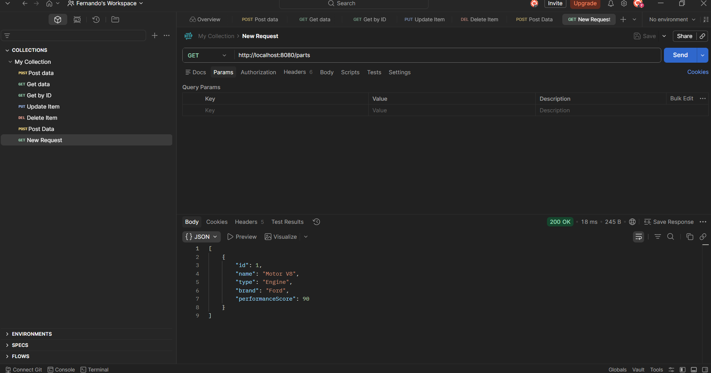
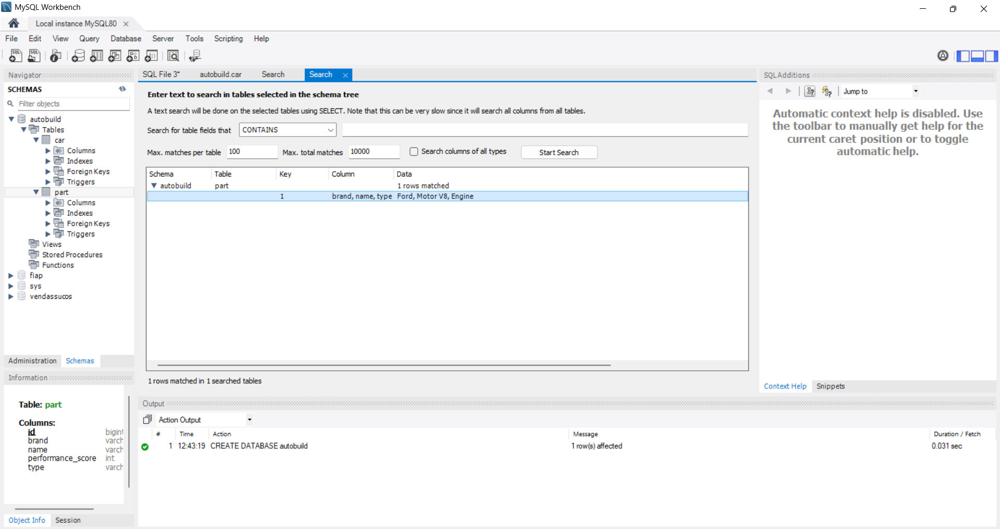
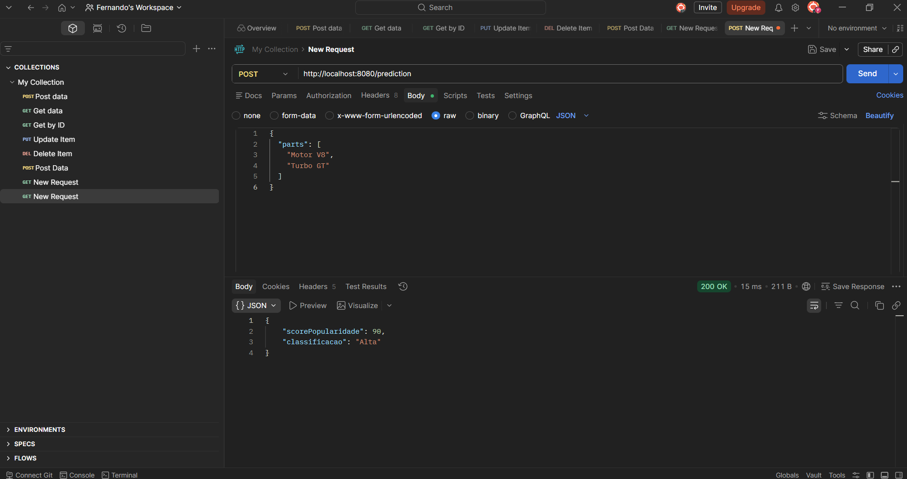

# 🚗 AutoBuild AI

Sistema desenvolvido em **Spring Boot + MySQL** com arquitetura orientada a serviços (SOA), criado para a disciplina de **Arquitetura Orientada a Serviços e Web Services**.

O projeto simula uma plataforma inspirada em sites de montagem de PCs, porém voltada para carros personalizados. O usuário pode cadastrar peças automotivas e gerar uma previsão de popularidade para o veículo montado.

---

# 📚 Objetivo do Projeto

O objetivo deste projeto é demonstrar:

* Implementação de APIs RESTful
* Integração com banco de dados MySQL
* Arquitetura SOA
* Separação em camadas
* Uso correto de métodos HTTP
* Documentação de APIs
* Comunicação via JSON
* Tratamento de erros e exceções

---

# 🛠️ Tecnologias Utilizadas

| Tecnologia      | Finalidade                    |
| --------------- | ----------------------------- |
| Java 21         | Linguagem principal           |
| Spring Boot     | Framework backend             |
| Spring Web      | Criação de APIs REST          |
| Spring Data JPA | Persistência de dados         |
| MySQL           | Banco de dados                |
| Swagger/OpenAPI | Documentação da API           |
| Maven           | Gerenciamento de dependências |
| Postman         | Testes de endpoints           |
| Lombok          | Redução de código boilerplate |

---

# 🏗️ Arquitetura do Projeto

O projeto foi organizado seguindo o padrão SOA (Service-Oriented Architecture), com serviços independentes e reutilizáveis.

```text
Frontend/Postman
       |
       v
REST API (Spring Boot)
       |
--------------------------------
|            |                |
CarService  PartService  PredictionService
       |
       v
MySQL Database
```

---

# 📂 Estrutura do Projeto

```text
autobuild-ai/
│
├── controller/
├── service/
├── repository/
├── model/
├── dto/
├── exception/
├── resources/
└── README.md
```

---

# ⚙️ Como Executar o Projeto

## 1️⃣ Clonar o repositório

```bash
git clone https://github.com/Fernando1403/Sprint1-SOA-AutoBuild
```

---

## 2️⃣ Abrir o projeto

Abrir no IntelliJ IDEA ou VS Code.

---

## 3️⃣ Criar banco de dados MySQL

Executar o comando abaixo no MySQL Workbench:

```sql
CREATE DATABASE autobuild;
```

---

## 4️⃣ Configurar o arquivo application.properties

Localização:

```text
src/main/resources/application.properties
```

Exemplo:

```properties
spring.datasource.url=jdbc:mysql://localhost:3306/autobuild
spring.datasource.username=root
spring.datasource.password=123456

spring.jpa.hibernate.ddl-auto=update
spring.jpa.show-sql=true

springdoc.swagger-ui.path=/swagger-ui.html
```

---

## 5️⃣ Executar a aplicação

Via terminal:

```bash
mvn spring-boot:run
```

Ou executar:

```text
AutoBuildAiApplication.java
```

---

# 📘 Swagger

Após iniciar a aplicação:

```text
http://localhost:8080/swagger-ui.html
```

O Swagger documenta automaticamente todos os endpoints da API.

---

# 🔌 Endpoints da API

## 🔩 Parts

| Método | Endpoint    | Descrição            |
| ------ | ----------- | -------------------- |
| GET    | /parts      | Lista todas as peças |
| GET    | /parts/{id} | Busca peça por ID    |
| POST   | /parts      | Cria nova peça       |
| DELETE | /parts/{id} | Remove peça          |

---

## 🚗 Cars

| Método | Endpoint |
| ------ | -------- |
| GET    | /cars    |
| POST   | /cars    |

---

## 🧠 Prediction

| Método | Endpoint    |
| ------ | ----------- |
| POST   | /prediction |

---

# 🧪 Exemplos de Requisições

## Criar peça

### POST

```text
http://localhost:8080/parts
```

### Body JSON

```json
{
  "name": "Motor V8",
  "type": "Engine",
  "brand": "Ford",
  "performanceScore": 90
}
```

---

## Buscar peças cadastradas

### GET

```text
http://localhost:8080/parts
```

### Exemplo de retorno

```json
[
  {
    "id": 1,
    "name": "Motor V8",
    "type": "Engine",
    "brand": "Ford",
    "performanceScore": 90
  }
]
```

---

## Fazer previsão de popularidade

### POST

```text
http://localhost:8080/prediction
```

### Body JSON

```json
{
  "parts": [
    "Motor V8",
    "Turbo GT"
  ]
}
```

### Resposta

```json
{
  "scorePopularidade": 90,
  "classificacao": "Alta"
}
```

---

# 📸 Exemplos de Funcionamento

## ✅ API funcionando no Postman

A imagem abaixo demonstra a API REST funcionando corretamente através do Postman, utilizando o endpoint GET `/parts`.



---

## ✅ Integração com MySQL

A imagem abaixo demonstra os dados persistidos corretamente no banco MySQL.



---

## ✅ Endpoint de previsão funcionando

A imagem abaixo demonstra o endpoint `/prediction` retornando corretamente uma previsão de popularidade.



---

# 🧠 Arquitetura SOA

O projeto foi dividido em serviços independentes:

| Serviço           | Responsabilidade          |
| ----------------- | ------------------------- |
| PartService       | Gerenciamento de peças    |
| CarService        | Gerenciamento de carros   |
| PredictionService | Simulação de popularidade |

Essa abordagem garante:

* Reutilização
* Baixo acoplamento
* Organização modular
* Facilidade de manutenção

---

# 🌐 Padrões Utilizados

* REST
* JSON
* HTTP Methods
* SOA
* MVC
* JPA/Hibernate

---

# ❌ Tratamento de Erros

O sistema possui tratamento global de exceções utilizando:

```text
@RestControllerAdvice
```

Exemplo:

* 404 → recurso não encontrado
* 500 → erro interno

---

# 🛢️ Persistência de Dados

A persistência é realizada utilizando:

* Spring Data JPA
* Hibernate
* MySQL

As tabelas são geradas automaticamente pela aplicação.

---

# 👨‍💻 Desenvolvido para FIAP Challenge

Projeto acadêmico desenvolvido para a disciplina:

**Arquitetura Orientada a Serviços e Web Services**

---

# ✅ Status do Projeto

✔️ Finalizado
